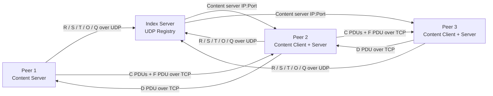
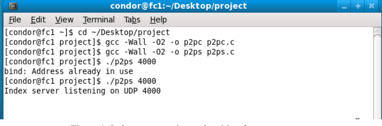
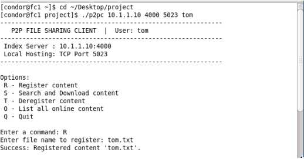
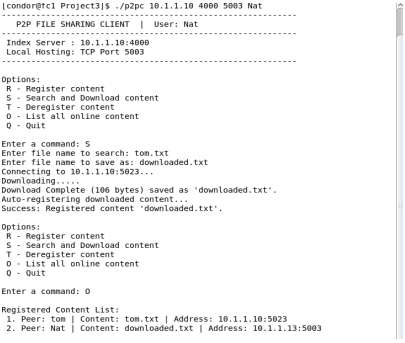
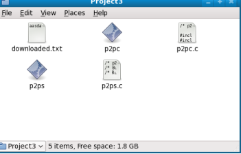
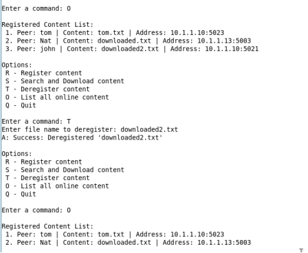
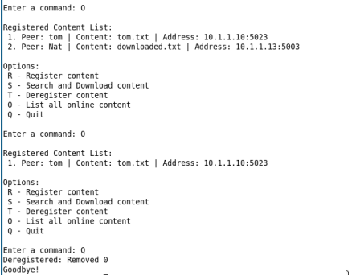

# Distributed P2P File Sharing System

A socket-based peer-to-peer (P2P) file sharing application written in C. The system uses a central UDP index server for control messages and direct TCP connections between peers for file transfer.

This project demonstrates how peers can register hosted content, search for files, download content directly from other peers, automatically become content servers after downloading, list registered content, and deregister content when exiting.

---

## Table of Contents

- [Overview](#overview)
- [Features](#features)
- [System Architecture](#system-architecture)
- [Protocol Design](#protocol-design)
- [Project Structure](#project-structure)
- [Build Instructions](#build-instructions)
- [Running the Application](#running-the-application)
- [Demo Workflow](#demo-workflow)
- [Example Screenshots](#example-screenshots)
- [Implementation Notes](#implementation-notes)
- [Troubleshooting](#troubleshooting)
- [Future Improvements](#future-improvements)

---

## Overview

This application contains two programs:

| Program | Role | Description |
|---|---|---|
| `p2ps.c` | Index Server | Maintains a registry of peers, hosted content, IP addresses, and TCP ports. |
| `p2pc.c` | Peer Client / Content Server | Lets a user register, search, download, list, deregister, and quit. Each peer can also serve files to other peers over TCP. |

The index server does **not** store actual file data. It only stores metadata that tells peers where content is available.

---

## Features

- Register local files with the index server
- Search for content by file name
- Download content directly from another peer
- Automatically register downloaded content as new hosted content
- List all online registered content
- Deregister a specific file
- Remove all entries for a peer when quitting
- UDP timeout handling to prevent the peer from freezing
- Chunked TCP file transfer using content PDUs
- Simple load-sharing through a least-used content server counter

---

## System Architecture



The control plane uses UDP. File transfer uses TCP.

---

## Protocol Design

Each message is sent using a PDU structure.

```c
typedef struct {
    char type;
    char peer[FIELDLEN];
    char content[FIELDLEN];
    unsigned short len;
    char data[BUFLEN];
} PDU;
```

### PDU Types

| Type | Name | Direction | Purpose |
|---|---|---|---|
| `R` | Register | Peer -> Index Server | Register a peer as a content server for a file. |
| `S` | Search | Peer <-> Index Server | Search for content and return an available content server address. |
| `D` | Download Request | Content Client -> Content Server | Request a file from a peer over TCP. |
| `C` | Content Data | Content Server -> Content Client | Carry file data chunks. |
| `F` | Finish | Server -> Client | Mark the end of a list or file transfer. |
| `T` | Deregister | Peer -> Index Server | Remove one registered file for that peer. |
| `O` | Online List | Peer <-> Index Server | Request and return all registered content entries. |
| `Q` | Quit | Peer -> Index Server | Remove all content registered by that peer. |
| `A` | Acknowledgement | Server -> Peer | Confirm successful operation. |
| `E` | Error | Server/Peer -> Peer | Report an error. |

---

## Project Structure

```text
Distributed-P2P-File-Sharing-System/
├── README.md
├── p2ps.c
├── p2pc.c
├── assets/
│   └── images/
│       ├── server-start.png
│       ├── peer-register.png
│       ├── peer-download-list.png
│       ├── downloaded-file.png
│       ├── deregister.png
│       └── quit.png
└── sample-files/
    ├── tom.txt
    └── hello.txt
```
---

## Build Instructions

Compile the index server:

```bash
gcc -Wall -O2 -o p2ps p2ps.c
```

Compile the peer:

```bash
gcc -Wall -O2 -o p2pc p2pc.c
```

If the source files are inside a `src/` folder:

```bash
gcc -Wall -O2 -o p2ps src/p2ps.c
gcc -Wall -O2 -o p2pc src/p2pc.c
```

---

## Running the Application

### 1. Start the index server

Terminal 1:

```bash
./p2ps 4000
```

Expected output:

```text
Index server listening on UDP 4000
```

### 2. Start Peer 1

Terminal 2:

```bash
./p2pc 127.0.0.1 4000 5001 Kay
```

Arguments:

| Argument | Example | Meaning |
|---|---:|---|
| Index server IP | `127.0.0.1` | IP address of the machine running `p2ps` |
| Index server UDP port | `4000` | UDP port used by the index server |
| Local TCP port | `5001` | TCP port used by this peer to serve files |
| Peer name | `Kay` | Name registered with the index server |

### 3. Start Peer 2

Terminal 3:

```bash
./p2pc 127.0.0.1 4000 5002 Nat
```

Use a different TCP port for each peer.

---

## Peer Commands

| Command | Action | Description |
|---|---|---|
| `R` | Register content | Register a local file with the index server. |
| `S` | Search and download | Search for content, download it from a peer, and auto-register the saved file. |
| `T` | Deregister content | Remove one content entry registered by this peer. |
| `O` | List online content | Print all registered peer/content/address entries. |
| `Q` | Quit | Deregister all content owned by this peer and exit. |

---

## Demo Workflow

### Step 1: Peer 1 registers a file

On Peer 1:

```text
Enter a command: R
Enter file name to register: tom.txt
```

Expected result:

```text
Success: Registered content 'tom.txt'.
```

### Step 2: Peer 2 searches and downloads the file

On Peer 2:

```text
Enter a command: S
Enter file name to search: tom.txt
Enter file name to save as: downloaded.txt
```

Expected result:

```text
Connecting to 127.0.0.1:5001...
Downloading...
Download Complete (...) saved as 'downloaded.txt'.
Auto-registering downloaded content...
Success: Registered content 'downloaded.txt'.
```

### Step 3: List registered content

On any peer:

```text
Enter a command: O
```

Expected result:

```text
Registered Content List:
 1. Peer: Kay | Content: tom.txt | Address: 127.0.0.1:5001
 2. Peer: Nat | Content: downloaded.txt | Address: 127.0.0.1:5002
```

### Step 4: Deregister content

```text
Enter a command: T
Enter file name to deregister: downloaded.txt
```

Expected result:

```text
A: Success: Deregistered 'downloaded.txt'
```

### Step 5: Quit

```text
Enter a command: Q
```

Expected result:

```text
Deregistered: Removed 1
Goodbye!
```

---

## Example Screenshots

Add screenshots from your testing under `assets/images/`.

### Index server startup



### Peer registering a file



### Peer searching, downloading, and listing content



### Downloaded file saved locally



### Deregistering content



### Peer quitting and cleaning up entries



---

## Implementation Notes

### Index Server (`p2ps.c`)

The index server stores registered content in a fixed-size table.

Each entry stores:

| Field | Purpose |
|---|---|
| `peer` | Name of the peer hosting the file |
| `content` | Name of the registered file |
| `ip` | IP address of the peer |
| `port` | TCP port where the peer serves downloads |
| `used` | Counter used to choose the least-used server |
| `in_use` | Marks whether the table slot is active |

The index server handles:

- `R`: add a new table entry
- `S`: return the address of a content server
- `T`: remove one entry owned by a peer
- `O`: return the list of all active entries
- `Q`: remove all entries owned by a peer

### Peer (`p2pc.c`)

The peer acts as both:

1. A UDP client that talks to the index server
2. A TCP content server that sends files to other peers

At startup, the peer forks:

- Parent process: handles user commands and UDP messages
- Child process: listens for TCP download requests

This allows a peer to remain interactive while still serving files.

---

## Troubleshooting

| Problem | Likely Cause | Fix |
|---|---|---|
| `bind TCP: Address already in use` | Another peer is already using that TCP port | Use a different port or kill the old process |
| Peer freezes after command | No UDP reply from index server | Check server IP, firewall, and that `p2ps` is running |
| Search says content is not registered | File was not registered or was deregistered | Run `O` to check available content |
| Register fails | File does not exist locally | Make sure the file is in the same folder as `p2pc` |
| Download fails | TCP port blocked or peer closed | Check peer is still running and port is reachable |

---

## Known Limitations

- Peer and content names are fixed-length fields in the PDU format.
- Each peer must use a unique TCP port.
- The index server stores its registry in memory only, so registrations are lost if the server stops.
- The system is designed for local network testing, not production internet deployment.
- No authentication or encryption is included.

---

## Future Improvements

- Use dynamic TCP port allocation with `getsockname()`
- Replace `fork()` with `select()` or `poll()` for single-process socket handling
- Add persistent registry storage
- Add file size and checksum verification
- Improve support for filenames with spaces
- Add automated test scripts
- Add verbose server logging for debugging

---

## Technologies Used

| Area | Technology |
|---|---|
| Language | C |
| Control messages | UDP sockets |
| File transfer | TCP sockets |
| Concurrency | `fork()` |
| Build tool | GCC |
| Platform | Linux / Unix-like systems |

---

## License

This repository is for academic and portfolio use. If you reuse this project, follow your institution's academic integrity policy and do not submit it as your own work.
